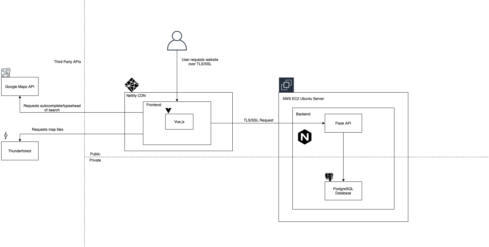

# Dublin Planning Perimission Map

## Introduction

The Dublin Planning Permission web application allows a user to explore a map of Dublin,
interact with recent planning permission applications and filter
the applications based on the decision made by the council as well as 
by when the application was submitted.

The main objective of this project was to explore the work involved in creating a full-stack web application, 
and to become familiar with some of the relevant modern technologies.

## Demo

**I have disbaled the api serving the web app and the Google autocoding, so much of the functionality is not present anymore**

Demo [Here](https://competent-jennings-57a7ec.netlify.app/) hosted on Netlify which accesses the AWS hosted parnold-tech.com API. 

## Technologies

### Frontend
- Vue.js
    - Javascript
    - HTML
    - CSS/SCSS
- Leaflet.js
- Elements of Bootstrap

### Backend
- Flask
    - Python
- SQLAlchemy
- PostgreSQL

### Network & Hosting
- Netlify
- AWS EC2
- Ubuntu
- Nginx 

## Diagram

## Backend Functions
The data was originally sourced from [opendata.dublincity.ie](https://opendata.dublincity.ie/PandDOpenData/).
It comes in the form of a single csv file that is updated and replaced regularly.
I processed the file and loaded the information into a PostgreSQL database. 
The information in the databse is queried through a flask server which uses SQLAlchemy for the ORM.

## Learning Outcomes
- Built and deployed a fullstack application from back to front.
- Gained a better understanding of Vue.js, NPM, Vue-cli and some of the available Vue libraries.
- Deployed frontend to Netlify CDN and used Netlify environment variables.
- Processed data into a PostgreSQL database and made it available to a Flask application through the SQLAlchemy ORM.
- Became more familiar with AWS, suing an elastic IP for the server and serving both the database and API on an EC2 instance.
- First experience using Nginx for the proxy server.
- Installed an SSL certificate and linked server to a DNS.
- Gained more experience with Git.

## Backend Code

Python code used for Flask API and SQLAlchemy modelling is available upon request.

## Possible Future Improvements

- Improve design and UI.
- Automate the collection and addition of new application information to the database.
- Additional filters and search capabilities.
- Serverside API handling (for google maps and thunderforest API keys).
- User API authentication for my own API.
- Better security on backend.
- More efficient database configuration.

